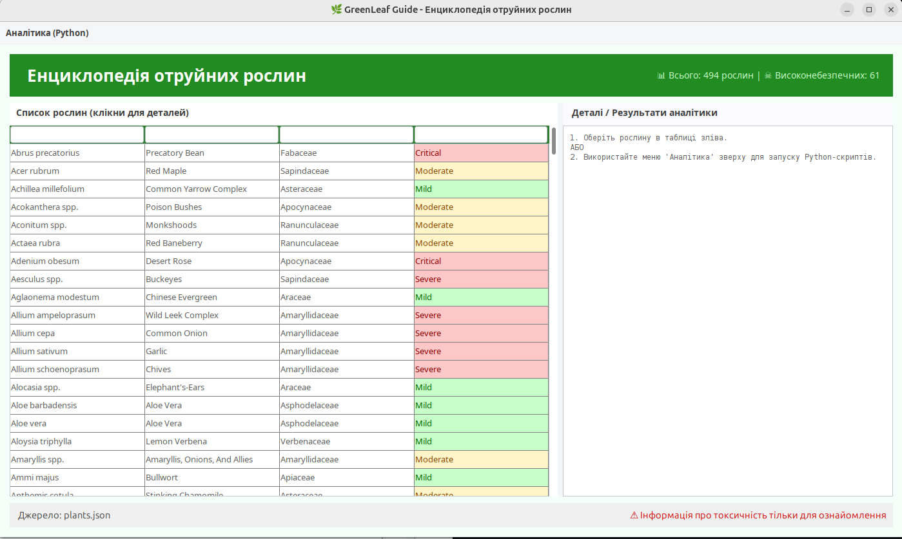
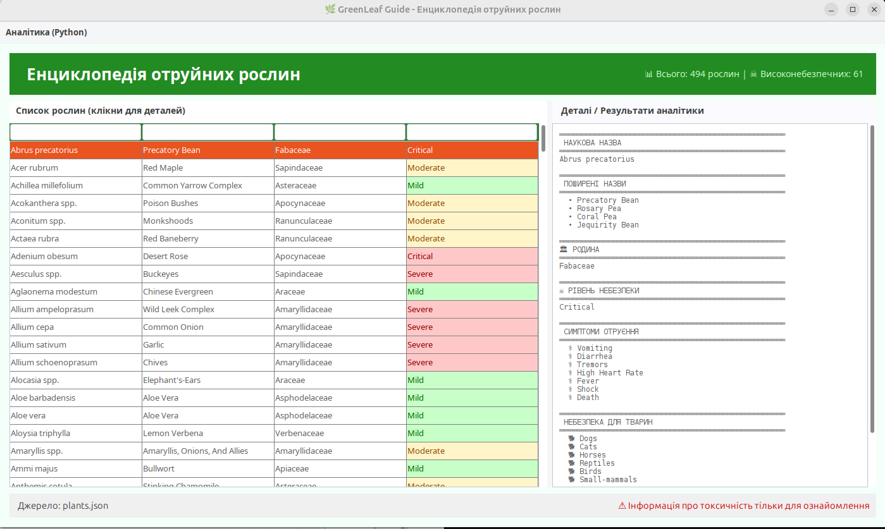

# 🌿 GreenLeaf Guide - Інструкція користувача

## 📖 **Що це за програма?**

**GreenLeaf Guide** — це довідник отруйних рослин, який допоможе:
- 👁️ **Побачити** список небезпечних рослин
- 🔍 **Дізнатися** детальну інформацію про кожну рослину
- 📊 **Проаналізувати** статистику
- ⚠️ **Захистити** домашніх улюбленців від отруєння

---

## **ЯК ПОЧАТИ РОБОТУ**

### **Крок 1: Підготовка**
1. Переконайтеся, що на Вашому комп'ютері встановлені **Python** та **Java**.

2. Відкрийте папку з проєктом.

### **Крок 2: Запуск (Windows/Linux)**

1. У папці з проєктом клікніть правою кнопкою миші (іноді з Shift) -> **"Відкрити термінал"** (або PowerShell/CMD).

2. Введіть команду та натисніть Enter:
    ```
    python main_launcher.py
    ```
    *(для Linux/macOS: ```python3 main_launcher.py```)*

3. У текстовому меню, що з'явиться, введіть цифру **4** і натисніть Enter:

    ```
    ДОСТУПНІ ЗАВДАННЯ:
    ...
    4. Запуск Java GUI (PlantGuide)
    ```

---

## **ЯК КОРИСТУВАТИСЯ ПРОГРАМОЮ**

### **Основний екран**
Вікно програми розділене на зони:

1. **ВЕРХНЄ МЕНЮ** — тут знаходяться всі інструменти аналітики ("Аналітика Python").

2. **ЛІВА ЧАСТИНА** — таблиця зі списком усіх рослин.

3. **ПРАВА ЧАСТИНА** — панель деталей, де показується інформація про рослину або результати аналізу.



## **Основні дії користувача**

#### **Перегляд інформації про рослини**
1. **Знайдіть** рослину в таблиці (можна прокручувати)
2. **Клацніть** один раз на потрібний рядок
3. **Праворуч** з'явиться:
   - Назва рослини
   - Родина
   - Рівень небезпеки
   - Симптоми отруєння
   - Для яких тварин небезпечна



#### **Пошук рослин, небезпечних для вашої тварини**
1. У верхньому меню натисніть **"Аналітика (Python)"**.
2. Натисніть кнопку **"Пошук для тварин"**
3. У віконці, що з'явиться, введіть назву тварини:
   - `dogs` — для собак
   - `cats` — для котів  
   - `horses` — для коней
   - `birds` — для птахів
   - `small mammals` — для дрібних ссавців  
   - `reptiles` — для рептилій
   - `fish` — для риб
4. Натисніть **ОК**
5. Результати з'являться у **правій панелі**


#### **Перегляд статистики**
1. У верхньому меню натисніть **"Аналітика (Python)"**.
2. Оберіть:
- **"Топ родин"** — які родини рослин найпоширеніші
- **"Статистика небезпеки"** — розподіл рослин за рівнем небезпеки
3. Результати з'являться у **правій панелі**

---

## **КОЛЬОРОВІ ПОЗНАЧЕННЯ**

Програма використовує кольори для легшого сприйняття:

| Колір | Значення |
|-------|----------|
| 🔴 **Червоний** | Висока небезпека (Severe, Critical) |
| 🟡 **Жовтий** | Помірна небезпека (Moderate) |
| 🟢 **Зелений** | Низька небезпека (Mild) |
| ⚪ **Білий** | Невідомий рівень небезпеки |


